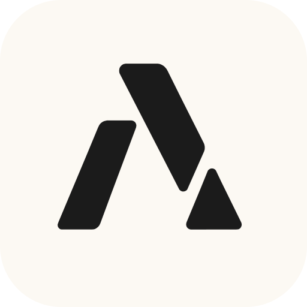
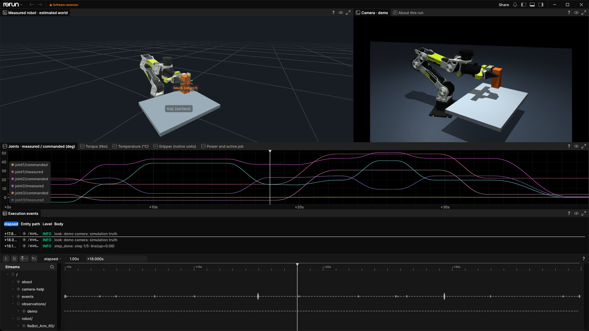

<p align="center">
  
</p>

# world-use

**Let AI agents operate robot arms.**

An agent writes a few steps of work at a time as a JSON plan. world-use checks each plan in a rehearsal on a
simulated twin of the robot, and refuses a plan that would break a limit with the number that would pass. Then it
runs the plan at 100 Hz, stops on unexpected contact and watches motor heat. Between the agent's decisions a daemon
holds the arm still, and every session leaves a flight record. Agents use it through the `wu` command, MCP or
Python.

Early software: tested in simulation and on one physical arm, a Seeed reBot ([hardware notes](docs/hardware.md)).

## Why not a raw robot API?

A model takes seconds to decide; an arm needs a command every 10 ms. Driving a reBot move by move, an agent kept it
moving for 11% of its powered time. The rest of the time the arm held still while the model thought, and holding a
raised pose heated the elbow about 8 C per minute. Planned and checked in phases, the same task kept the arm moving
for up to 41% of the time ([what we measured](DESIGN.md#what-we-measured)). A plan that would break a limit is
refused before anything moves:

```console
$ wu run '[{"do":"line","left":0.08}]'
refused in rehearsal, so nothing moved:
check FAILED: 1 limit would be broken, so the kernel would refuse this plan and nothing would move
  step 1/1: line(left=0.08): this turns j1/j5/j6 with the tool at U+0.220; turning needs U+0.267 or higher (5 cm above the start height) (hint: lift at least 5 cm more first)
  rehearsed past them: 5.4 s simulated, 5.3 s of it moving
  ends with the tool at F+0.302 L+0.092 U+0.220 (work)
  heat: j3 +0.7 C, to about 26 C
from here a 3 cm line can go up, forward; not down or back (out of reach with the gripper at this angle); left or right (turning needs the tool at U+0.267).
$ wu run '[{"do":"line","up":0.05},{"do":"line","left":0.08}]'
job 1 done: 2 steps done
t+9s | idle, holding | tool F+0.302 L+0.092 U+0.270 | grip 0.05rad (0mm) -0.00 | tau -0.0 +0.7 +6.9 +1.8 +0.0 -0.0 | hottest j3 26C
```

## Install

```sh
uv tool install --with-executables-from rerun-sdk "world-use[mcp,rerun] @ git+https://github.com/anyact-ai/world-use"
```

This needs [uv](https://docs.astral.sh/uv/), which finds or installs Python 3.13 or newer. The extras are `mcp`
(the MCP server), `rerun` (the 3D viewer), `vision` (EdgeTAM tracking, with PyTorch) and `rebot` (the physical
reBot's driver, on Python 3.13).
The install exposes `wu` and the `rerun` viewer command.

## Try it

`wu demo` runs a scripted pick-and-place on a simulated reBot, checks the result against the simulator and saves a
flight record in a new folder under `./runs`:

```console
$ wu demo
nominal: the block was placed at the target; jobs done, done, done; torque off
record: runs/block-demo
animation: runs/block-demo/demo.gif
$ wu inspect runs/block-demo    # summarize the record
$ wu view runs/block-demo       # open it in Rerun
```

`wu demo --scenario missing` takes the block away: the grip closes on nothing, so the script forgets the block,
opens, lifts away and goes home. The [block example](examples/pick-place) explains the scenarios and the task for an
agent, including how to [adapt the block task and workcell](examples/pick-place/README.md#adapt-the-task).



Then drive the arm yourself. These commands produce the transcript above:

```sh
wu up --workcell block    # the daemon, with a simulated reBot, a tray and a block; torque off
wu card                   # what this robot is and can do
wu look side              # saves a picture with the known boxes drawn on it and prints its path
wu enable
wu run '[{"do":"line","left":0.08}]'
wu run '[{"do":"line","up":0.05},{"do":"line","left":0.08}]'
wu home-route '[]' && wu home && wu down
```

The last line sets the home route, folds the arm home, switches torque off and stops the daemon. `wu check`
checks a plan without running it, and `wu help` lists the steps a plan can use.

## Give it to an agent

Start the simulation (`wu up --workcell block`), then paste this into a shell agent such as Claude Code, Codex or
Gemini CLI:

```text
Run `wu policy` and follow it. A simulated robot arm is running. Move the orange block to F=0.34, L=-0.07 in the
work frame, standing on the tray. Then go home, switch torque off, and report what you did and what you saw.
```

`wu policy` prints [the brief](src/world_use/POLICY.md) every agent reads first. Over MCP the same commands are
tools; the server talks to the daemon, so start that first. Add it to Claude Code with
`claude mcp add world-use -- wu mcp`, or give other MCP clients this entry:

```json
{"mcpServers": {"world-use": {"command": "wu", "args": ["mcp"]}}}
```

## Python

```python
from world_use import Client, Plan

robot = Client()
phase = Plan("lift and open").line(up=0.06).gripper(aperture_mm=60)
result = robot.run(phase.spec(), wait=60)
print(result["status"])
```

With the daemon up and torque on, this prints `done`. The tool install keeps its own environment, so run scripts
with `uv run --with "world-use @ git+https://github.com/anyact-ai/world-use" python task.py`.

## More

- [Records](docs/records.md): every session's plans, outcomes, telemetry and pictures, for `wu inspect`,
  `wu replay`, `wu view` and `wu fit`.
- [Simulation](docs/simulation.md): MuJoCo with the reBot's meshes, frictional grasps and rendered cameras.
- [Measuring from pictures](docs/perception.md): positions in work-frame metres from a camera, and plans that stop
  once a measurement is too old. Depth comes from simulated cameras for now.
- [The reBot](docs/rebot.md): CAN, cameras and operation. The arm has no brakes: keep an operator at its
  motor-supply switch.
- [Other arms](docs/adapters.md): a URDF, a TOML description and a small driver. Supported: arms with revolute
  joints, five-joint arms included, and grippers with one joint (revolute or prismatic) or two prismatic fingers.
- [DESIGN.md](DESIGN.md): the rules and the measurements behind them. [CHANGELOG.md](CHANGELOG.md): what changed.

## Develop

```sh
git clone https://github.com/anyact-ai/world-use.git
cd world-use
uv sync --locked
uv run pytest
uv run ruff check .
uv run ty check src
```

## License

Apache-2.0. The bundled reBot model (URDF and meshes) is Seeed Studio's, under CERN-OHL-W-2.0; see its
[notice](src/world_use/bodies/rebot/NOTICE.md).
