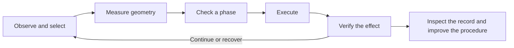

# Agent tool design

world-use helps an agent turn a task into a reusable robot procedure: observe the
scene, construct a checked phase, execute it, and verify the result. Python and
MCP share the same measurements, plans, jobs and flight records.

The [procedure guide](procedure-tools.md) documents the implemented tools and
examples. The [perception contracts](perception-design.md) describe capture and
measurement. This page covers the design choices and what to build next.

## Design choices

- **Work in phases.** The agent chooses targets, constraints, expected effects
  and recovery. A phase contains enough checked motion to make useful progress
  between observations. Ordinary Python functions compose reusable procedures.
- **Keep one execution path.** Geometry references resolve into the existing
  numeric PlanSpec. The kernel owns power, limits and motion; model inference and
  geometry calculations run outside its control loop.
- **Connect decisions to evidence.** Captures, targets, geometry and prepared
  plans have explicit references. Coordinates carry frames and units; derived
  estimates preserve their source observations and assumptions.
- **Verify what happened.** Declare criteria before acting and evaluate them
  using new observations and measured feedback. Report command completion,
  observed effect and final power state separately. Missing evidence is unknown.
- **Make limits visible.** Discovery reports available capabilities. Results
  expose capture age, target loss, fit limitations and collision coverage.
  Bound inference, stored data, retries and response size.
- **Account for elapsed time.** Physics and motor heating continue during model
  calls. Keep status and stop responsive, prepare providers before powered work,
  and give each procedure an explicit return and power strategy.

## Next work

First, reuse the block procedure across held-out positions, appearances and
visibility conditions. Keep its original criteria and inspect failures. Then
build a second task, such as opening a door, with explicit contact and articulation
assumptions. Share code where those tasks demonstrate a common need.

Add capabilities when an intended task needs them:

| Need | Candidate capability |
|---|---|
| Selecting objects by description | Text grounding that returns candidates for explicit selection. |
| Following a handle or contact point | Material-point tracking with explicit continuity and loss. |
| Repeated spatial calculations | Relations between measured geometry in a declared frame. |
| Resolving uncertainty from another camera | Projection into an existing calibrated capture with timing and occlusion checks. |
| Grasping beyond known upright shapes | Grasp proposals calibrated for the actual tool, with approach and collision checks. |

These capabilities are not implemented yet. They should feed the existing
execution and verification path. Physical RGB-D also needs a chosen sensor,
measured timing and calibration, followed by a separately authorized hardware
experiment.

## Validation

For each addition, keep the same task, model, criteria and time budget when
comparing outcomes. Run continuous physics and keep simulator truth confined to
independent evaluation. Record success after release, false verification passes,
unknown outcomes, tool calls, elapsed time and powered waiting.

Exercise stale evidence, target loss, incorrect selections, provider failure,
lost responses and failed recovery. Stop and status must remain usable under
inference load. Contract tests and fixed simulation fixtures establish integration
behavior; held-out tasks and hardware measurements establish broader capability.
