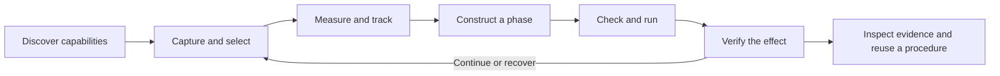

# Tools for developing and running robot procedures

**Status: stage 1 implemented; later capabilities remain proposals.** The
[implemented procedure contracts](procedure-tools.md) are the source of truth for
available tools, schemas and limits. They extend [measured perception](perception-design.md)
with selection, bounded geometry fits, prepared phases, outcome verification and
history through Python and MCP. Physical RGB-D and general grasp generation are
not implemented. The operating authority remains
[POLICY.md](../src/world_use/POLICY.md).

The goal is to let an agent complete a manipulation task without inventing geometry,
manually converting frames, interpreting a successful command as task success, or
reconstructing an incident from an unbounded log. Comprehensive means covering the
whole decision cycle, with outputs that feed the next tool.

## Product direction

world-use should let an agent develop a robot procedure, test it in MuJoCo, execute
it through the same checked runtime, and establish what actually happened. The
useful output of a solved task is a reusable procedure with evidence behind it.
Perception providers supply inputs to that workflow.

Organize the interface around three existing foundations:

- **Checked phases.** A phase connects source observations, geometric targets,
  an existing PlanSpec and declared outcome criteria. Its record preserves what
  was assumed, what was checked, what moved and what was subsequently observed.
  Extend the current plan/job/record contracts; no new workflow language is needed.
- **Procedures that improve through use.** Start with ordinary Python functions
  that compose phases. Test them across scene variations, give retries explicit
  limits, and return an actionable incident when their assumptions stop holding.
  Repeated execution should require fewer model decisions while preserving the
  original outcome checks. Promotion to reuse follows tests, not one apparent success.
- **A continuous physical session.** Motion, perception, inference and recording
  all consume real time. Power, temperature, current evidence and recovery remain
  visible through that session, including while the model is thinking.

These priorities come from the repository's [measured experience](../DESIGN.md).
They define the product independently of a particular paper or model stack.
The paper's perception contracts are useful references, and similar names are
appropriate where the underlying operation is the same. Novelty of a tool name
is not a selection criterion.

## What to take from the paper

[Robo-Harness K1](https://arxiv.org/abs/2609.29389), especially Appendix A,
connects semantic selection, calibrated geometry, material-point tracking and
grasp proposals. These are candidate solutions to task needs, with limits worth
preserving when adopted: visible surfaces are not complete object poses; tracking
is not identity proof; a proposed grasp is not an executable or collision-certified
grasp.

| Paper capability | world-use design |
|---|---|
| Region grounding and inspection | Explicit selection first; optional text grounding returns candidates for selection. |
| Depth, geometry and region relations | Typed geometry with source evidence, explicit frames, assumptions and fit diagnostics. |
| Persistent material anchors | Separate point tracks from region masks; report loss and continuity changes explicitly. |
| Cross-camera inspection | Project into an existing calibrated capture; report depth agreement and occlusion. |
| Grasp proposals | Calibrated reBot poses, visible limitations and independent checked execution. |
| Several movement and alignment tools | Existing finite plan steps through `check` and `run`; geometry references remove coordinate copying. |
| History and progress memory | Retrieve flight records; agent notes remain attributed claims. |
| Simulator completion feedback | Observable postconditions for agents; simulator truth stays in the independent evaluator. |

The paper pauses simulation during perception and API waiting. Its paired
comparison changes perception, memory, control and completion feedback together.
We should test each addition with continuous physics and actual inference latency.
Its Panda grasp checkpoint and retained Panda gripper also do not establish reBot
compatibility. These are reasons to evaluate our approach, not evidence that it
already outperforms the paper.

The supplied video transcript motivates a complementary choice: turn repeated
reasoning into tested procedures, and use the model at ambiguity and failure
boundaries (14:22–19:12; 27:17–27:38). A procedure should use this same interface,
with explicit preconditions, bounded retries and observable postconditions.

## Interface decisions

1. **One execution route.** Keep `run` and the existing plan vocabulary. Geometry,
   grasp and verification tools never actuate. Calibration and power/return tools
   retain their explicit side effects and existing kernel enforcement.
2. **Evidence flows through references.** Images, observations, geometry and plans
   have typed IDs. A plan can consume measured geometry without the model copying
   coordinates. The resolved numeric plan remains inspectable.
3. **Every geometric value has a frame and source.** All new 3D contracts use
   metres, named frames, capture times and calibration revisions. Existing units
   such as `aperture_mm` remain explicit and compatible.
4. **Validity has several dimensions.** Report selection ambiguity, visibility,
   continuity, depth support, fit quality and age separately. Do not compress
   them into an unexplained confidence percentage.
5. **The model chooses; code computes.** The model chooses the object, constraints,
   intended effect and recovery strategy. Code transforms coordinates, measures
   relations, resolves plans, checks limits and evaluates declared predicates.
6. **Capabilities are explicit.** RGB-only, calibrated RGB-D, material-point
   tracking and grasp proposal are distinct capabilities. Missing depth or a
   provider gives `unsupported`; it never triggers invented metric geometry.
7. **Bound all work and context.** Return summaries and references by default,
   inspect images on request, batch related observations, limit inference and
   retain bounded state. No model or storage work enters the control tick.

## Candidate additions after stage 1

The shipped tools, exact fields and limits live in the
[procedure contracts](procedure-tools.md). Later tools need a motivating task,
a consumer for their output, and evidence that composition of existing tools is
insufficient. Tool count and coverage of the paper's catalog are not release goals.

| Candidate | Task need and boundary |
|---|---|
| `find_targets` | Text selection when pointing or boxing becomes a bottleneck. Return at most four candidates and ambiguity information; selection remains explicit. |
| `track_points` | Material correspondence for a handle or contact point. Region masks and mask centroids cannot substitute for physical point tracks. Refresh through `observe_targets`; report loss and identity changes. |
| `relate` | Repeated spatial calculations between typed geometry: distance, displacement, axis/plane alignment. Carry source evidence, frame and capture skew; observed overlap cannot prove containment. |
| `project_geometry` | Resolve uncertainty using another existing calibrated capture. Report depth agreement, occlusion and missing support; projection cannot transfer target identity. |
| `propose_grasps` | Intended objects that exceed the known upright-box procedure. Return at most three candidates with approach/jaw axes, opening, source evidence and separate proposal/kinematic/collision diagnostics. |

Keep the existing finite motion vocabulary. `move_to` already takes a position
and tool/jaw directions; geometry references remove coordinate copying. New
perception capabilities should feed the same checked execution and verification
path. The existing `grasp` step performs local grip retries; it is not a general
grasp proposal provider.

Material points require an explicit continuity contract, with tests for loss,
camera motion and depth-surface switches. Cross-camera geometry also requires
calibrated timing; cross-host clock support is a separate requirement. A later
articulation estimator needs observed motion, not a hinge inferred from one plane.

General grasping needs actual reBot TCP, finger-pad and opening-direction
calibration. The current planner omits fingers, payloads, the pedestal and
self-collision. Address the relevant coverage or validate an explicitly restricted
task domain before exposing arbitrary-object grasps. Sparse depth samples cannot
certify hidden free space, and a Panda checkpoint cannot establish reBot fit.

Extend verification only with observable predicates that the next task needs.
Freeze thresholds before acting and retain per-clause results as predicates grow:
a conjunction fails if a valid clause fails, passes only when all pass, and is
otherwise unknown. A VLM opinion cannot replace a missing metric measurement.
Keep command completion, observed task outcome and final power state separate.

The same ownership boundaries apply to every addition: daemon-owned source
measurements, shared bounded calculations, optional client-side providers,
existing plan preparation and kernel enforcement, and recorded evidence viewed
through Rerun. No second scene graph, behavior engine, web viewer or perception
service is justified yet. Add a procedure registry only when multiple demonstrated
tasks need discovery and reuse.

## Delivery sequence and acceptance

Build complete task paths. The order follows procedure reliability and reuse;
perception additions are selected by observed task failures.

| Stage | Deliverable | Acceptance evidence |
|---|---|---|
| 1. Complete the existing task through MCP | Structured discovery/results; `select_target`, `observe_targets`, `inspect_image`, `fit_geometry`, `verify_effect`, `inspect_run`; reference resolution through `check`/`run`; submission deduplication. Share the current known-block estimator and predicates with Python. | A scripted procedure selects, measures, checks, lifts, verifies, places and inspects through public MCP tools. Duplicate requests cannot execute twice. Ambiguity, loss, expired evidence, changed calibration and unavailable artifacts are explicit. Python and MCP produce equivalent results from the same captures. |
| 2. Establish procedure reuse and transfer | Reuse the block procedure across held-out scene variations, then develop a door/handle procedure with explicit articulation assumptions and opening criteria. Factor only contracts shared by the demonstrated tasks. | Procedures retain their original checks, reduce model calls and powered waiting, and return useful incidents outside their domain. The same evidence-to-plan-to-result contract serves both tasks without a new orchestration framework. |
| 3. Resolve demonstrated perception bottlenecks | Select additions independently: `track_points` when a handle needs material correspondence; `relate` when spatial calculations recur; `project_geometry` when an existing second camera resolves ambiguity; `find_targets` when selection is the bottleneck; `propose_grasps` when known-shape approaches fail on intended objects. | Each addition improves its motivating task against the existing baseline under matched budgets. Tracking tests include loss, camera motion and depth-surface switches. Grasping needs actual gripper calibration, appropriate approach/finger/payload checks or documented restrictions, and independent after-release evaluation. Unneeded providers remain unimplemented. |
| 4. Validate the supported hardware path | Add a selected physical RGB-D sensor with measured timing and calibration; carry the same procedure, execution and outcome contracts onto the supported arm. | A separately authorized experiment measures actual latency, geometric error, recovery and outcomes. Simulator performance is not hardware validation. |

Stage 1 is implemented, with deterministic contract tests and a real-model
integration check. These do not establish autonomous-agent performance or
generalization. Each further increment must keep the core install usable without
model weights or a GPU. Do not change
the existing literal-plan or Python tracker contracts as a side effect of MCP work.
Stages 2 and 3 can interleave when the second task exposes a concrete missing
capability; implementing an entire perception family is never a prerequisite.

Testing must cover outcomes beyond happy-path tool invocation:

- Replay exact captures for coordinate conversion, crop mapping, fit degeneracy,
  target epochs, uncertainty/unknown handling and Python/MCP parity.
- Exercise delayed inference, queue overload, provider crash, artifact loss,
  stale plans, session restart and lost submission responses. Stop/control access
  must remain responsive under inference and recording load.
- Run continuous-physics tasks with fixed seeds and held-out positions/appearances.
  Include shadows, partial visibility, wrong selections, distractors, dropped
  objects, slipped grasps, moved destinations and failed recovery. Keep simulator
  truth outside every agent-facing tool.
- Compare the same model, prompts, tasks, budgets and scoring with additions
  enabled individually. Retain all task outcomes and record infrastructure failures
  separately. Freeze criteria before collecting the comparison.
- Report after-release success, false verification passes, unknown rate, identity
  switches, geometry error, invalid/refused calls, tool calls/tokens, wall time,
  powered waiting, temperatures, stop latency, tick timing and peak memory.
  Establish numerical budgets from the target platform before calling a release
  validated; fixed-fixture CI alone is not a generalization benchmark.

The first release gate is the complete stage-1 workflow and its failure cases.
Point tracking, text grounding and learned grasping remain advertised only as
they earn their own task evidence. Judge progress by independently verified
procedures, successful reuse, diagnosis quality and the cost of powered execution.
Keep the paper comparison as a source of ideas, not an implementation checklist.
