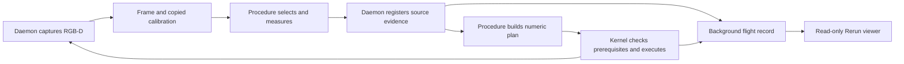

# Measured perception for checked robot phases

Measured perception extends the camera, tracking, recording and job APIs.
A procedure can measure visible surfaces, declare the evidence a motion depends on,
and inspect that evidence alongside execution in Rerun. The [block example](../examples/perception)
uses a known upright shape on a known clear tray, with the object's position withheld.
Physical RGB-D acquisition, arbitrary object poses and grasp generation remain future work.

## Ownership



Camera acquisition belongs to the daemon. Inference, target selection, shape
assumptions, planning decisions and verification belong to the procedure. The
kernel owns power, limits and command execution. Its evidence checks use only
copied metadata: no images, file access, inference or network calls occur there.
These responsibilities use the existing daemon, kernel and flight record.

## Captures and measurements

`Client.frame(camera, depth=False)` returns native upright RGB pixels without
creating a recorded image. With `depth=True`, MuJoCo cameras return aligned
float32 optical-z depth in metres; missing samples are NaN. Other camera types
explicitly refuse depth acquisition. RGB-only tracking remains supported.

A `cameras.Frame` carries image identity, camera name, daemon-host monotonic
capture time, session, calibration revision, a copied `View`, optional depth,
and timing provenance. Simulation also supplies a tool pose from the copied
state. Depth and transform arrays are read-only. The daemon caches its own image
copy, so editing client pixels cannot rewrite a registered capture. File cameras
retain their original identity and age when the file has not changed.

RGB and depth render from one copied MuJoCo state. Copying holds the physics lock;
rendering does not. Rendering uses the actual lens, while measurement uses the
declared calibration. Views are immutable; install a replacement with `camera.view = new_view`
when recalibrating. An incorrect calibration therefore produces incorrect
measurements, as it would on hardware. Depth conversion uses the renderer's
clipping planes. Neither object poses nor instance segmentation IDs are exposed.

The first version assumes rectified pinhole pixels. Rotation, scaling and
intrinsics must describe the same upright image. A moving camera needs
exposure-time feedback and hand-eye calibration before metric measurement is
supported. Host monotonic timestamps assume local clients; network clock
synchronization is outside this API.

```python
from world_use.perception import measure

frame = robot.frame("overhead", depth=True)
measurement = measure(frame, point=[220, 180], target="chosen-surface")
# Or: measure(frame, mask=observation.mask, target="block-1")
receipt = robot.record(evidence=measurement, context={"purpose": "approach"})
```

`measure` accepts exactly one native pixel point or boolean mask. It back-projects
pixel centres into the base frame. Mask measurement erodes one boundary pixel,
samples at most 2,048 interior pixels and requires at least 16 valid samples and
50% valid depth. A point requires one valid depth. A depth separation over 5 cm
within the central 80% of sorted samples refuses a mixed region. These are
conservative sample filters, not a general segmentation-quality test.

The result holds supporting pixels and points, method, units, diagnostics,
validity, failure reason, source frame and optional target label. Compact receipts
include a median visible-surface centre and 2nd/98th-percentile bounds. Invalid
results contain no usable geometry. None of these values is an invisible object
centre, full object size, identity certificate or absolute calibration accuracy.
A small depth spread does not establish those properties.

EdgeTAM retains its existing one-region, bounded-history API. Use its mask with
the exact frame that produced it. `tracked` means a mask was returned; it does
not prove identity. A mask centroid is not a persistent material point. Target
labels are procedure-owned references; use a new label after reselection unless
continuity is explicitly established. Cross-camera association is deferred.

## Registration and execution

`Client.record(evidence=measurement)` sends frame identity and pixel support.
The daemon recomputes geometry from its cached capture and uses its own capture
time and calibration revision. Client-supplied coordinates or rewritten times
are not authoritative. Segmentation remains a procedure assertion. Registration
can return an invalid receipt for diagnosis; that receipt cannot authorize motion.
Optional note/context annotations link task assumptions to the receipt.

The acquisition cache holds at most eight frames and 64 MiB. It retains 256
compact receipts. Registered measurement support has a separate 64 MiB bound for
geometry fitting; that support can outlive the acquisition cache. A missing source
or receipt requires reacquisition for operations that need it. Admission copies
small prerequisite values into the job, so later
cache eviction or storage trouble cannot rewrite an accepted job's requirements.
At most 16 prerequisites may be supplied per job.

```python
if not receipt["valid"]:
    raise RuntimeError(receipt["reason"])

result = robot.run(
    plan,  # Task code derives numeric targets and explicitly asserts any planning boxes.
    requires=[{"evidence": receipt["id"], "max_age_s": 5}],
    wait=60,
)
```

A prerequisite checks session, calibration revision and capture age before
rehearsal, at admission, at execution start, after asynchronous path preparation,
and before subsequent built-in steps. Reinstalling calibration invalidates prior
evidence even if its numerical values are unchanged. These checks also apply
with `check=False`. Unsupported custom behaviors are refused before any preceding
step starts, because their internal actuation boundaries cannot be enforced.

The caller chooses the age limit for the task. It is not inferred from tracker
confidence, extended by a long rehearsal, or renewed by registration. A stale
prerequisite between steps holds measured feedback and cancels the remaining
work. An already executing step can finish after expiry. This is an admission
condition, not continuous visual collision detection; use short phases and the
existing watchdogs. Tracker loss that was never reported to the procedure cannot
be detected by the kernel.

Perception does not automatically change `World`. A fitted box is an explicit
policy assertion with evidence and assumptions in its source, installed before
rehearsal. Existing boxes are not universally time-limited. Existing callers
without prerequisites retain their behavior.

Checked admission uses a control revision for submissions, stop requests,
power/reset, model, home-route, contact and world changes. Observations,
annotations and recording events do not change that revision. Snapshot comparison
still checks commands, limits, measured drift and world contents; it applies the
existing held-object settling allowance used by trajectory preparation. Reversing
a mutation or consuming a stop does not restore the validity of an old check.

## Recording and viewing

Registration emits an `evidence` event and queues source artifacts for background
persistence. Version 1 artifacts under `perception/<id>/` contain `rgb.png`,
`overlay.png`, `surfaces.npz` (depth, sampled pixels and points), and
`measurement.json` (receipt, selection and copied calibration). Job submission
events record prerequisite IDs and age limits. An `evidence_saved` event appears
only after all source artifacts commit.

The artifact queue is bounded by 64 MiB and 64 pending items, in addition to the
currently committing item. Overrun produces `evidence_lost` events and persistent
loss accounting. Storage errors remain visible in recording status; failed writes
can retry. They do not disable stop/release or invalidate the copied live guard
metadata. Closing refuses new artifacts, drains pending work and publishes the
completion marker only after the final artifact events and telemetry commit.

Rerun reads these records without a camera, tracker, robot driver or command
client. Source RGB and depth use capture time; selected support and measured
points use result availability time. Observed points are separate from estimated
world boxes, and invalid results clear the corresponding observed surface.
Missing artifacts produce a visible warning. Displayed points are historical
observations, not a continuously refreshed map. Job events retain the applicable
freshness limits; there is no universal visual expiry for every use of a point.

MCP exposes `camera_frame`, `measure_pixels` and `run(requires=...)` using the
same Python contracts. Frame IDs reference a bounded local inspection cache.
`measure_pixels` accepts a point or explicit rectangular region; it does not
silently run segmentation. Optional `wu mcp --vision` adds selection and refresh
in a private client-side model process. Geometry fitting, prepared phases and
effect verification use the [shared procedure contracts](procedure-tools.md).
Dense arrays stay out of model text context.

## First task and validation

The [example](../examples/perception) uses a known 4 × 4 × 10 cm upright block,
a fixed calibrated overhead camera and a known clear tray. Its estimator needs
a substantially visible top face and refuses insufficient or implausible extent.
Those constraints are task assumptions, not general pose estimation.

A short lift compares observed object displacement with synchronized measured
tool displacement. Placement checks observed target proximity, known support
height, an open gripper and tool withdrawal. Verification returns pass, fail or
unknown. An occluded or missing block is unknown. Estimated attachment in `World`
is never used as visual confirmation. A separate evaluator alone receives
simulator truth, and evaluates after release before homing.

The procedure makes one attempt. Loss or disagreement ends the dependent phase;
its recovery is limited to lowering over this known clear tray, opening and
withdrawing. Return and power release retain the kernel's normal checks. This
recovery must not be copied to arbitrary hardware scenes. Model loading occurs
before enabling, and the live daemon continues physics and feedback during
perception and recording.

The runner provides four conditions: fixed nominal estimate, one-shot depth,
refreshed localization, and refreshed localization with visual verification.
Its RGB color fixture selects only from rendered pixels and supports deterministic
integration testing. With `--model edgetam`, selection is seeded by that same RGB
box and subsequent masks come from the pinned real model. Color resegmentation is
not evidence of learned tracking quality. Every condition uses the same after-release
evaluator. Preserve raw records and denominators for any published comparison.

Geometry, expiry, cache bounds, storage failure, replay timing and the live block
path, including delayed inference and missed-grasp recovery, have regression
coverage. The core suite uses deterministic masks and the color fixture. A separate
CPU vision CI job runs the pinned EdgeTAM model through the task and beyond its
tracking history window, retaining source evidence, prompt masks and timing data.
These fixed-fixture checks do not establish general tracking accuracy. Held-out
positions, long occlusions, calibration perturbations, GPU execution and hardware
RGB-D still need measured evaluation. Do not claim a learned-perception benchmark
from these integration runs.

## Work that waits for evidence

Add text grounding when selecting among objects costs more than explicit selection;
point tracking when a task needs material correspondences; a grasp provider when
known-shape approaches fail on intended objects. A hardware grasp provider needs
reBot finger calibration and approach/payload collision checks; the coarse planner
cannot certify arbitrary mesh-level grasps.

Reusable skills begin as Python procedures with preconditions and result checks.
A skill registry, automated code promotion, retrieval system or fine-tuning needs
repeated tasks and data that justify it. Physical RGB-D integration begins with an
actual sensor and measured calibration, rather than a generic camera framework.
